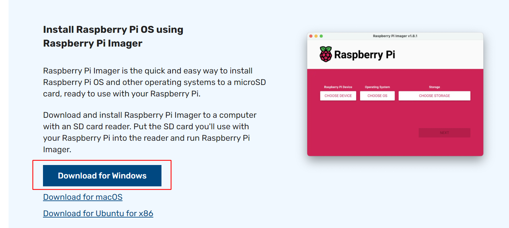
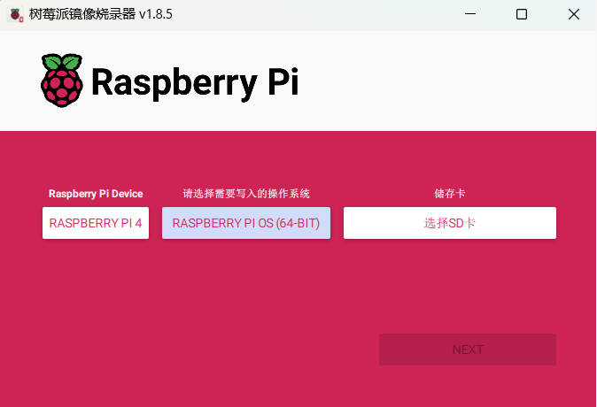

# 树莓派 Agent

## 简介

树莓派 Agent 是一个运行在树莓派上的程序，用于将树莓派的状态信息发送到云端，以便用户可以通过云端查看树莓派的状态信息。

## 安装

### 1. 树莓派镜像安装
#### 1.1 下载树莓派镜像安装包
[树莓派官网](https://www.raspberrypi.com/software/)

#### 1.2 根据树莓派版本选择合适操作系统

本例选择的设备：树莓派4B，操作系统是：Raspberry PI OS(64-bit)
#### 1.3 插入SD卡一键安装


### 2. 树莓派操作系统环境配置
#### 2.1 一键脚本配置
```
xxx.sh
```
#### 2.2 手动配置
##### 2.2.1 升级并安装python3.8
```
#升级应用库
sudo apt-get update
sudo apt-get upgrade
#下载并编译python3.8
wget https://www.python.org/ftp/python/3.8.0/Python-3.8.0.tgz
tar zxvf Python-3.8.0.tgz
cd Python-3.8.0
sudo ./configure<!--  -->
sudo make
sudo make install
#删除并替换python2为python3.8
rm /usr/bin/python
sudo ln -s /usr/local/bin/python3.8 /usr/bin/python
```

##### 2.2.2 安装并配置virtualenv
```
pip install virtualenv
pip install virtualenvwrapper
#配置环境变量
sudo nano ~/.bashrc
export WORKON_HOME=$HOME/virtualenvs
export PROJECT_HOME=$HOME/codes
export VIRTUALENVWRAPPER_VIRTUALENV=$HOME/.local/bin/virtualenv
VIRTUALENVWRAPPER_PYTHON=/usr/bin/python
source ~/.local/bin/virtualenvwrapper.sh
```

##### 2.2.3 安装agent
